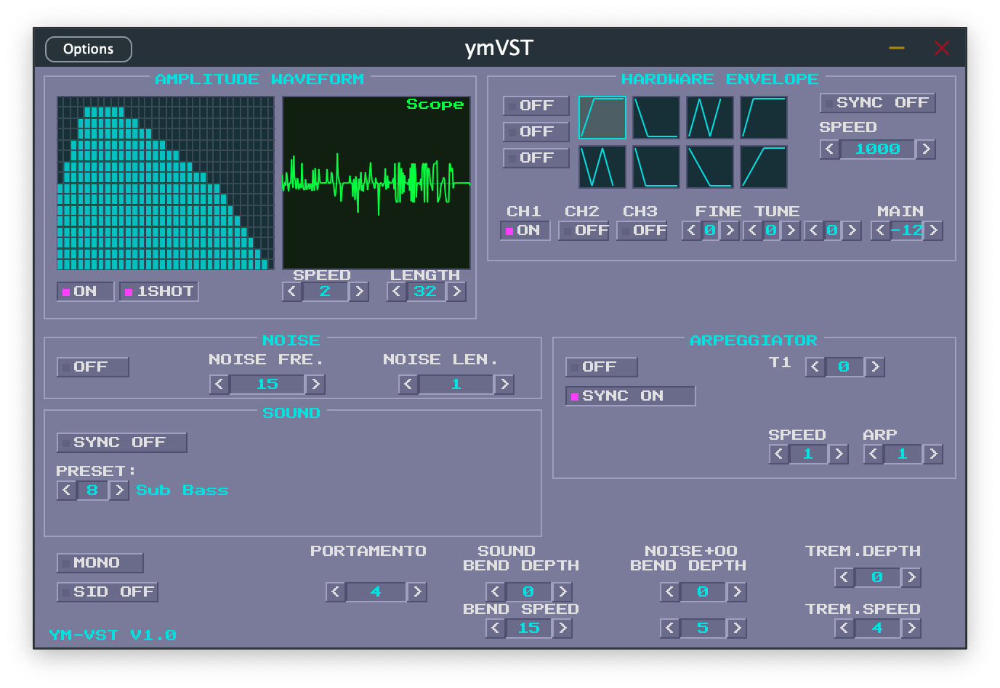

# ymVST for macOS

A macOS-native (Apple Silicon) VST3/AU plugin that recreates the sound of the Atari ST's YM2149 sound chip. Inspired by Gareth Morris's [ymVST](https://www.preromanbritain.com/ymvst/) (2003).

Uses the [ayumi](https://github.com/true-grue/ayumi) emulator for accurate YM2149/AY-3-8910 chip emulation, with a feature layer adding arpeggiator, amplitude waveform editor, portamento, pitch bend, tremolo, and SID mode on top.



## Requirements

- macOS (Apple Silicon or Intel)
- CMake 3.22+
- Xcode Command Line Tools (`xcode-select --install`)

## Build

```bash
# First build (downloads JUCE ~1-2 min)
cmake -B build -DCMAKE_BUILD_TYPE=Release
cmake --build build --config Release
```

This builds all three targets: VST3, AU, and Standalone.

To build a specific target:

```bash
cmake --build build --target ymvst_VST3 --config Release
cmake --build build --target ymvst_AU --config Release
cmake --build build --target ymvst_Standalone --config Release
```

## Install

Copy or symlink the plugins to the standard macOS locations:

```bash
# Symlink (recommended for development)
ln -sf "$(pwd)/build/ymvst_artefacts/Release/VST3/ymVST.vst3" ~/Library/Audio/Plug-Ins/VST3/
ln -sf "$(pwd)/build/ymvst_artefacts/Release/AU/ymVST.component" ~/Library/Audio/Plug-Ins/Components/

# Or copy
cp -r build/ymvst_artefacts/Release/VST3/ymVST.vst3 ~/Library/Audio/Plug-Ins/VST3/
cp -r build/ymvst_artefacts/Release/AU/ymVST.component ~/Library/Audio/Plug-Ins/Components/
```

Rescan plugins in your DAW after installing.

## Test standalone

```bash
open build/ymvst_artefacts/Release/Standalone/ymVST.app
```

## Features

- 3 square wave tone channels with per-channel enable, fine tune, tone/noise mixing
- Noise generator (frequency 0-31)
- 16 hardware envelope shapes with configurable speed
- User-drawn amplitude waveform editor (32-step, 4-bit)
- Arpeggiator with configurable speed, length, sync
- Portamento, sound bend, noise bend
- Tremolo (depth + speed)
- SID mode (hard sync between channels)
- MIDI velocity mapped to 4-bit volume
- MIDI pitch bend and mod wheel support
- Full parameter automation from DAW
- State save/restore (including waveform data)
- Retro Atari ST GEM desktop-style UI

## Project structure

```
CMakeLists.txt          Build system (JUCE via FetchContent)
libs/ayumi/             Vendored ayumi YM2149 emulator (MIT)
src/
  PluginProcessor.*     JUCE audio processor, parameter tree, MIDI
  PluginEditor.*        GUI root, layout, callback wiring
  YmEngine.*            DSP engine wrapping ayumi + feature layer
  gui/
    BitmapFont.*        8x8 pixel font renderer
    RetroLookAndFeel.*  GEM-style colors and bevel drawing
    BeveledButton.*     On/off toggle widget
    SpinnerControl.*    Numeric value with arrow buttons
    SectionLabel.*      Bordered section header
    WaveformEditor.*    Clickable amplitude grid (32 cells)
    ScopeDisplay.*      Real-time oscilloscope
    HardwareWaveformSelector.*  Envelope shape picker
```

## Credits

- **Gareth Morris** - original [ymVST](https://www.preromanbritain.com/ymvst/) for Windows (2003), which inspired this project's feature set, UI design, and MIDI CC mapping
- **Peter Sovietov** - [ayumi](https://github.com/true-grue/ayumi), the YM2149/AY-3-8910 emulator at the heart of this plugin
- **JUCE** - [framework](https://juce.com/) for cross-platform audio plugin development

## License

GPL v3 (due to JUCE free license). Ayumi is MIT licensed.
